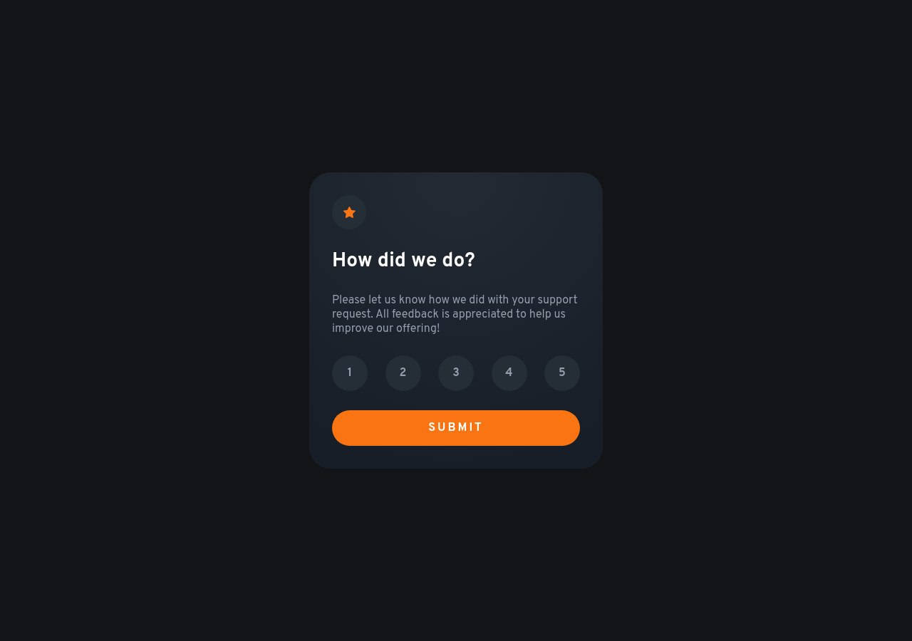

# Frontend Mentor - Interactive rating component solution

This is a solution to the [Interactive rating component challenge on Frontend Mentor](https://www.frontendmentor.io/challenges/interactive-rating-component-koxpeBUmI). Frontend Mentor challenges help you improve your coding skills by building realistic projects. 

### Screenshot

### Links

- Solution URL: (https://github.com/maga-sv/interactive-rating-component)
- Live Site URL: (https://interactive-rating-component-ms.netlify.app/)

## Author

- Frontend Mentor - (https://www.frontendmentor.io/profile/maga-sv)
- Twitter - (https://twitter.com/magadvlpr)